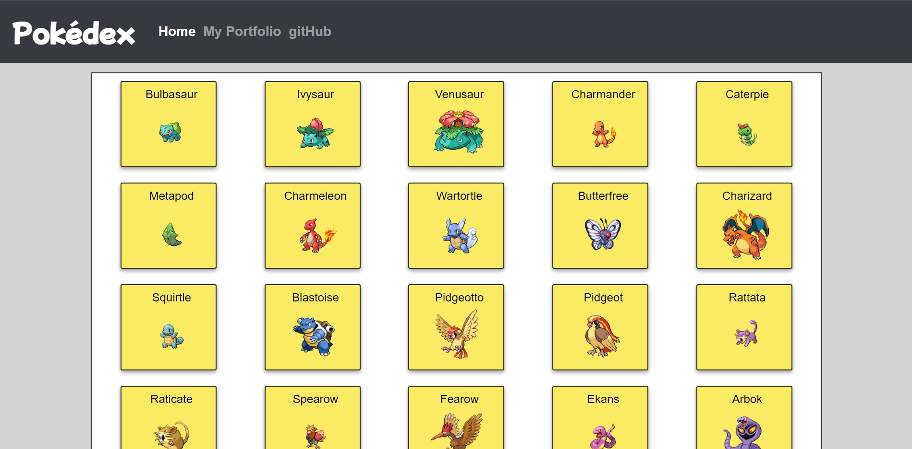

# **Pokédex App**

By using an external API, the app is able to populate a list of the first 151 pokémon and by interacting with each pokemon, the user can access to more information
about the selected pokémon.

## Built With

- HTML
- CSS
- JavaScript
  - Fetch
  - Promise
  - Ajax
